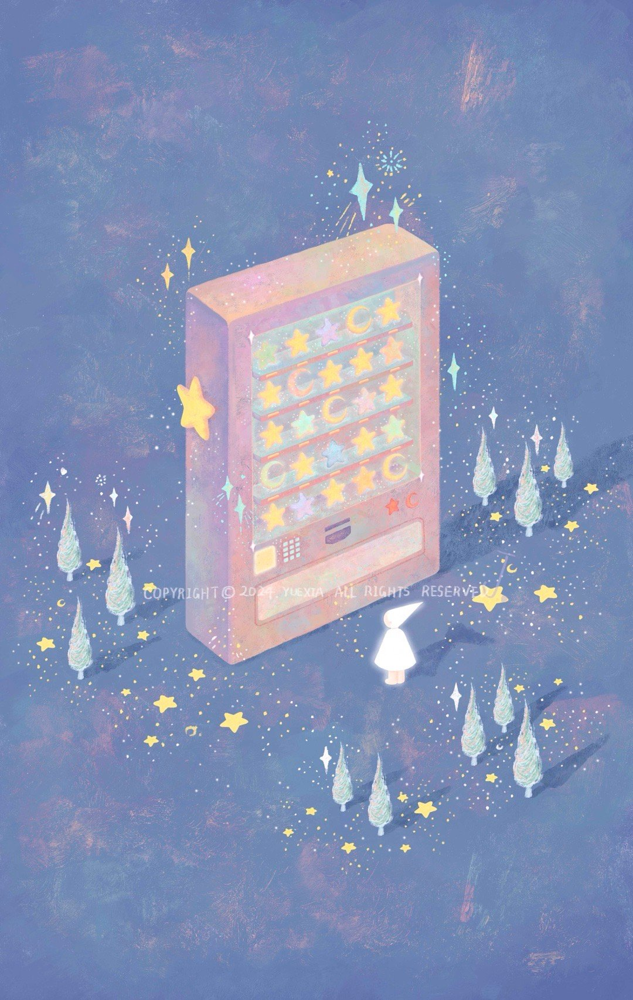
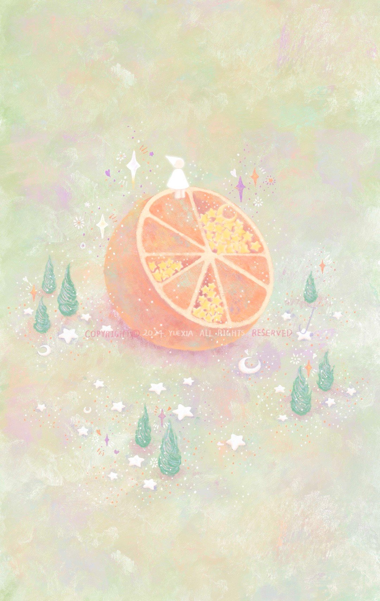
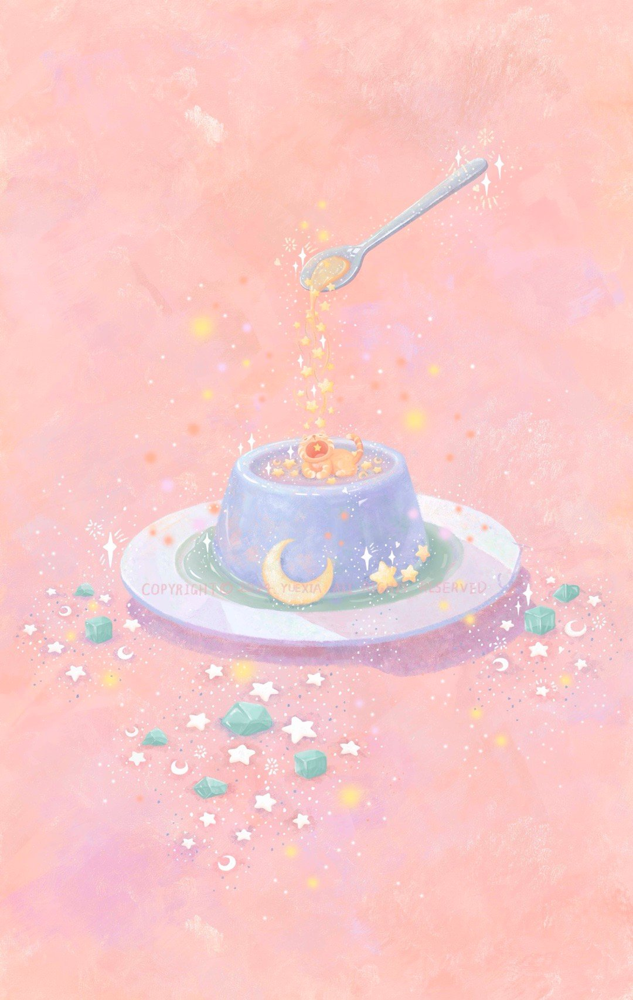
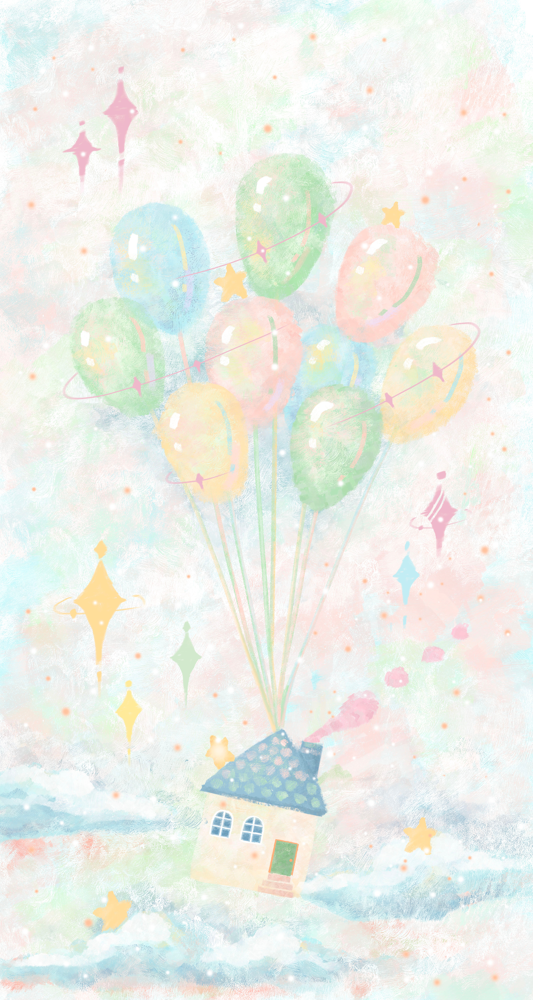
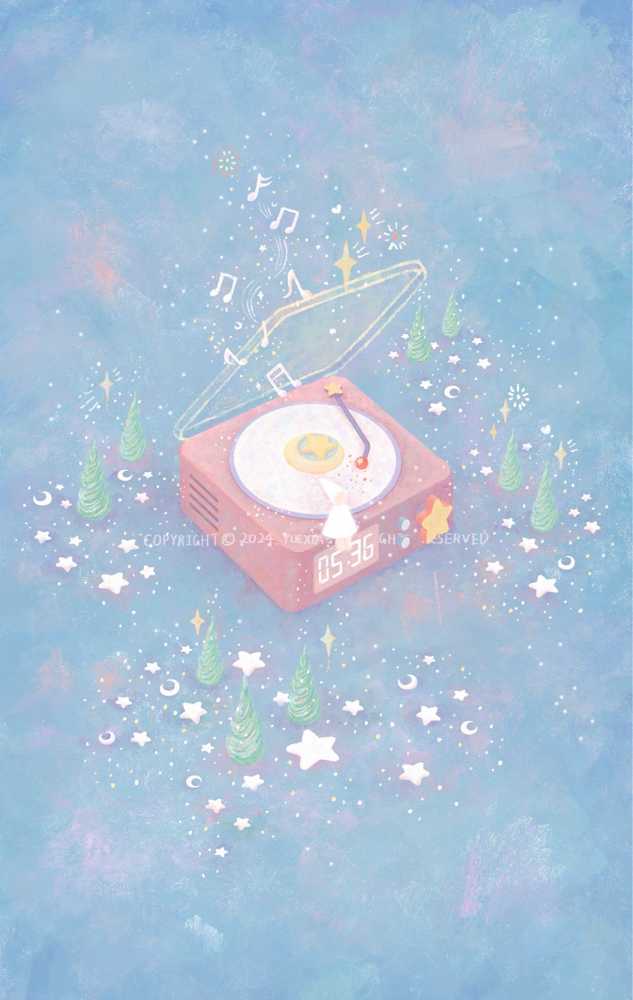
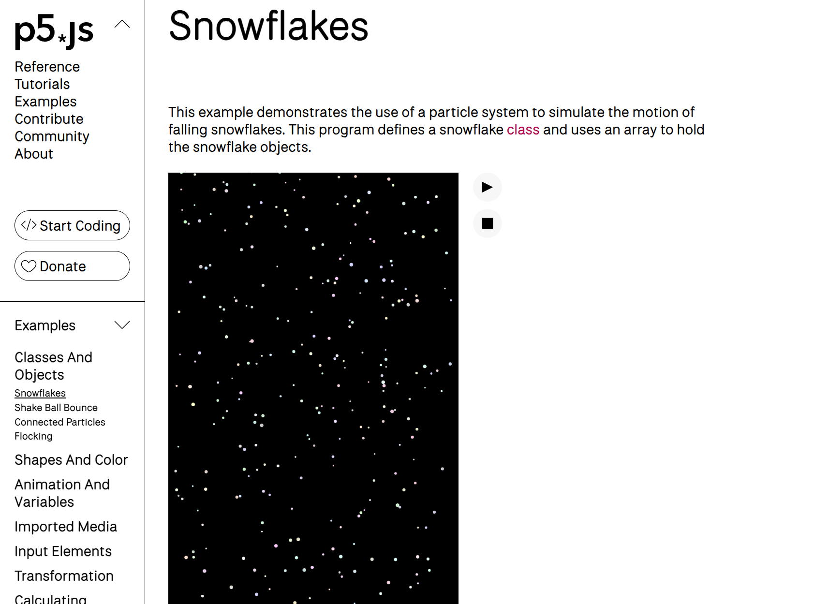
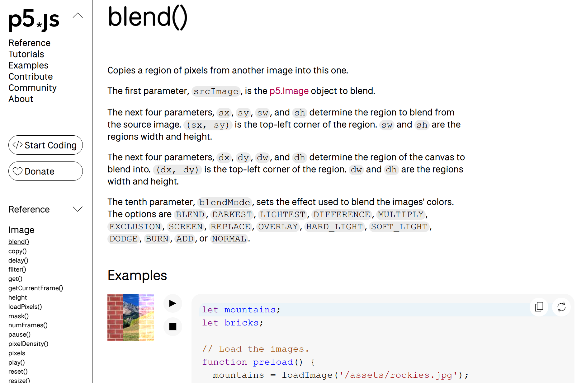

# jihe0479_9103_tut9
My first repository for IDEA9103
This is my first local change to the repo!
# Header 1
## Header 2
### Header 3
#### Header 4
##### Header 5
###### Header 6
This is a normal paragraph
**Bold Text** or __Bold Text__
*Italic Text* or _Italic Text_
Unordered Lists:

- Item 1
- Item 2
  - Subitem 2.1
  - Subitem 2.2
Ordered Lists:
1. First Item
2. Second Item
3. Third Item
Links
To create a hyperlink, you can use the following format:

[Link Text](https://www.google.com
Links to an external site.)

Images with existing links
Images can be added similarly to links but with an added ! at the beginning:


Code Blocks
```
function helloWorld() {
console.log("Hello, world!");
}
```
---

# Week 9 quiz 
## Part 1: Imaging Technique Inspiration
### The source of inspiration I chose is the works of illustrator moon. Her pictures often feature a main tone of pinkish purple, complemented by soft halos and dreamlike compositions. In this picture, the star vending machine and the floating light spots form a wonderful sense of space. This "fantastical and gentle" visual effect is very much in line with the atmosphere of the interactive story I want to create. Therefore, I hope to draw on her style of color gradation and luminous elements in the project. ^^
- The Mysterious Vending Machine of Stars

- The Star Guest Who Lives Inside an Orange

- A Sweet Orange Dream on Blue Pudding

- A Wandering Little House

- The Melody of Stars Echoes Through the Forest

## Part 2: Coding Technique Exploration
### To achieve the floating stars and soft light effects in the illustration, I selected two p5.js examples as technical references.
1. Snowflakes
[Snowflakes](https://p5js.org/zh-Hans/examples/classes-and-objects-snowflakes/)

2. Blend
[Blend](https://p5js.org/reference/p5.Image/blend/)

